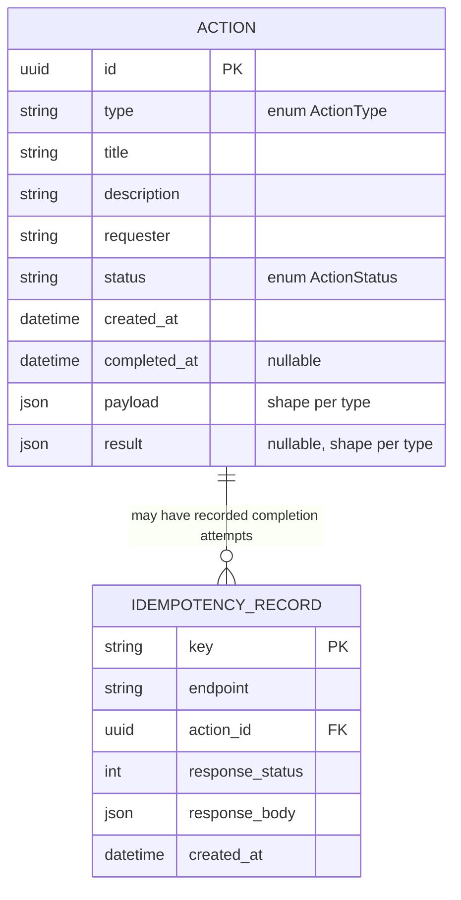

# Domain — Pending Actions

## `Action` entity

| field | type | notes |
|---|---|---|
| `id` | uuid | PK |
| `type` | enum `ActionType` | `expense_approval` \| `deployment_review` \| `documentation_upload` \| `onboarding` |
| `title` | str | |
| `description` | str | |
| `requester` | str | who raised it (free text, no auth) |
| `status` | enum `ActionStatus` | `pending` \| `completed` |
| `created_at` | datetime | |
| `completed_at` | datetime \| null | |
| `payload` | JSON | shape depends on `type`, see below |
| `result` | JSON \| null | filled on completion, shape depends on `type` |

## Entity-relationship diagram

Notes:
- There is no table per action type (`ActionType` is an enum on `Action.type`, not an entity) — the polymorphism lives in `payload`/`result` (JSON) and is resolved in code via Strategy, not in the relational schema.
- `IdempotencyRecord.action_id` is a logical FK to `Action.id` with no strong ownership: an idempotency record outlives the request that produced it even though it conceptually "belongs" to an already completed `Action`.

## Action types

| type | payload (at creation / seed) | result (at completion) |
|---|---|---|
| `expense_approval` | `{amount: float, currency: str, receipt_url: str}` | `{approved: bool, comment: str}` |
| `deployment_review` | `{service: str, version: str, environment: str}` | `{approved: bool, notes: str}` |
| `documentation_upload` | `{document_name: str}` | `{filename: str, path: str, size: int, content_type: str}` (real file) |
| `onboarding` | `{employee_name: str, checklist: list[str]}` | `{completed_steps: list[str]}` |

## Extensibility of action types (Open/Closed from day 0)

Action types are designed to grow without touching existing code — only by adding files.

**Mechanism — registry with auto-discovery (plugin pattern):**
- `handlers/base.py` defines the ABCs (`JsonCompletionHandler`, `FileCompletionHandler`), a `_REGISTRY: dict[ActionType, type[Handler]]`, a `@register(action_type)` decorator that enrols the class in the registry, and `get_handler(action_type)` that resolves from it.
- Importing the `handlers` package walks its directory (`pkgutil.iter_modules`) and imports every module automatically — the side effect of that import runs each handler's `@register(...)`. **Nobody maintains an import list.**
- Each handler owns its contracts: two Pydantic models in the same file as the handler — `creation_model` (shape of the `payload` at creation) and, for JSON-completed types, `payload_model` (shape of the `/complete` body). Nothing centralised in `schemas.py` — high cohesion, one type = one self-contained file.
- `GET /action-types` and the OpenAPI `oneOf`s are derived from the registry: a new type documents itself and the frontend's creation form is generated from its `payload_schema` with no new frontend code.

**To add a fifth action type, the only changes are:**
1. Add the new member to `ActionType` (enum) — the single edit to an existing file, and a declarative one (no logic).
2. Create `handlers/new_type.py` with the handler class + its models, decorated with `@register(ActionType.NEW_TYPE)`.

Nothing else is touched: not the service, not the routers, not `schemas.py`. That is what makes the design extensible from moment zero rather than after a future refactor.

## Endpoints

- `GET /action-types` → registered types: `[{type, label, completion: "json"|"file", schema_name, payload_schema: <JSON Schema>}]`. Comes from the registry; the frontend uses it for the type selector and to generate the creation form.
- `GET /actions?status=&type=` → list of `Action` (optional filters)
- `GET /actions/{id}` → one `Action`
- `POST /actions` (JSON `{type, title, description, requester, payload}`) → **201** with the created `Action` in `pending`. `payload` is validated with the type's handler `creation_model` (**422** if it fails; **400** if the type does not exist).
- `POST /actions/{id}/complete` (JSON, body validated per type) → for `expense_approval`, `deployment_review`, `onboarding`
- `POST /actions/{id}/upload` (multipart, `file`) → only for `documentation_upload`

Cross-cutting rules:
- `/complete` and `/upload` return **400** when called on an action of a type that does not belong to them (e.g. `/complete` on a `documentation_upload`).
- The three mutating endpoints (`POST /actions`, `/complete`, `/upload`) require an `Idempotency-Key` header (**400** if missing).
  - Same key repeated → the stored response is returned, without reprocessing or duplicating the effect.
  - New key on an action that is already `completed` → **409 Conflict**.
  - Validation errors (422) are not cached against the key — the client may retry with a corrected body.

## Explicit scope (decided; do not reopen without a reason)

- Actions are created via `POST /actions`; in addition, a fixed seed (one per type) runs when the API starts with an empty table, so the app can be tried immediately.
- No authentication — single implicit actor.
- No handling of two concurrent requests racing on the same `Idempotency-Key` (single-operator tool; a lock would be the fix if that changes).
