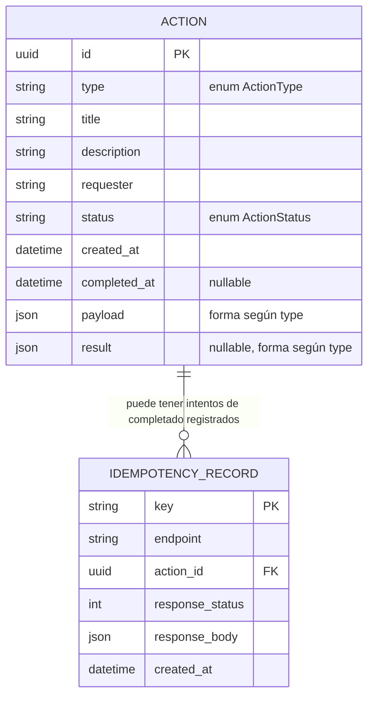

# Dominio — Pending Actions

## Entidad `Action`

| campo | tipo | notas |
|---|---|---|
| `id` | uuid | PK |
| `type` | enum `ActionType` | `expense_approval` \| `deployment_review` \| `documentation_upload` \| `onboarding` |
| `title` | str | |
| `description` | str | |
| `requester` | str | quién la generó (texto libre, sin auth) |
| `status` | enum `ActionStatus` | `pending` \| `completed` |
| `created_at` | datetime | |
| `completed_at` | datetime \| null | |
| `payload` | JSON | específico por tipo, ver abajo |
| `result` | JSON \| null | llenado al completar, específico por tipo |

## Diagrama Entidad-Relación (DER)

Notas del DER:
- No hay tabla por tipo de acción (`ActionType` no es una entidad, es un enum en `Action.type`) — el polimorfismo vive en `payload`/`result` (JSON) y se resuelve en código vía Strategy, no en el esquema relacional.
- `IdempotencyRecord.action_id` es FK lógica a `Action.id`, sin relación de propiedad fuerte: un registro de idempotencia sobrevive aunque conceptualmente "pertenezca" a una `Action` ya completada.

## Tipos de acción

| type | payload (al crear/seed) | result (al completar) |
|---|---|---|
| `expense_approval` | `{amount: float, currency: str, receipt_url: str}` | `{approved: bool, comment: str}` |
| `deployment_review` | `{service: str, version: str, environment: str}` | `{approved: bool, notes: str}` |
| `documentation_upload` | `{document_name: str}` | `{filename: str, path: str, size: int, content_type: str}` (archivo real) |
| `onboarding` | `{employee_name: str, checklist: list[str]}` | `{completed_steps: list[str]}` |

## Extensibilidad de tipos de acción (Open/Closed desde el día 0)

Los tipos de acción están diseñados para crecer sin tocar código existente — solo agregando archivos nuevos.

**Mecanismo — registry con auto-discovery (patrón plugin):**
- `handlers/base.py` define las ABCs (`JsonCompletionHandler`, `FileCompletionHandler`), un `_REGISTRY: dict[ActionType, type[Handler]]`, un decorador `@register(action_type)` que inscribe la clase en el registry, y `get_handler(action_type)` que resuelve desde ahí.
- Al importar el paquete `handlers`, se recorre el directorio (`pkgutil.iter_modules`) e importa cada módulo automáticamente — el efecto secundario de esa importación ejecuta el decorador `@register(...)` de cada handler. **Nadie mantiene una lista manual de imports.**
- Cada handler es dueño de su propio contrato: dos Pydantic models en el mismo archivo que el handler — `creation_model` (forma del `payload` al crear) y, para los de completado JSON, `payload_model` (forma del body de `/complete`). Nada centralizado en `schemas.py` — cohesión alta, un tipo = un archivo autocontenido.
- `GET /action-types` y los `oneOf` del OpenAPI se derivan del registry: un tipo nuevo se auto-documenta y el formulario de creación del front se genera desde su `payload_schema` sin código nuevo en el front.

**Para agregar un 5to tipo de acción, los únicos cambios son:**
1. Agregar el miembro nuevo a `ActionType` (enum) — única edición a un archivo existente, y es declarativa (no lógica).
2. Crear `handlers/nuevo_tipo.py` con la clase handler + su DTO, decorada con `@register(ActionType.NUEVO_TIPO)`.

Nada más se toca: ni `factory.py`, ni `action_service.py`, ni los routers, ni `schemas.py`. Esto es lo que hace extensible el diseño desde el momento 0, no un refactor a futuro.

## Endpoints

- `GET /action-types` → tipos registrados: `[{type, label, completion: "json"|"file", payload_schema: <JSON Schema>}]`. Sale del registry; el front lo usa para el selector de tipo y para generar el formulario de creación.
- `GET /actions?status=&type=` → lista de `Action` (filtros opcionales)
- `GET /actions/{id}` → detalle de una `Action`
- `POST /actions` (JSON `{type, title, description, requester, payload}`) → **201** con la `Action` creada en `pending`. `payload` se valida con el `creation_model` del handler del tipo (**422** si no cumple; **400** si el tipo no existe).
- `POST /actions/{id}/complete` (JSON, body validado según el tipo) → para `expense_approval`, `deployment_review`, `onboarding`
- `POST /actions/{id}/upload` (multipart, `file`) → solo para `documentation_upload`

Reglas transversales:
- `/complete` y `/upload` devuelven **400** si se llaman sobre una acción de un tipo que no les corresponde (ej. `/complete` sobre una `documentation_upload`).
- Los tres endpoints mutantes (`POST /actions`, `/complete`, `/upload`) exigen header `Idempotency-Key` (**400** si falta).
  - Misma key repetida → se devuelve la respuesta ya guardada, sin reprocesar ni duplicar el efecto.
  - Key nueva sobre una acción que ya está `completed` → **409 Conflict**.
  - Errores de validación (422) no se cachean contra la key — se puede reintentar corrigiendo el body.

## Alcance explícito (decidido, no re-discutir sin motivo)

- Las acciones se crean vía `POST /actions`; además hay un seed fijo (una por tipo) al arrancar la API con la tabla vacía, para poder probar de inmediato.
- Sin autenticación — actor único implícito.
- Sin manejo de carrera de dos requests concurrentes con la misma `Idempotency-Key` (fuera de foco, demo single-user).
